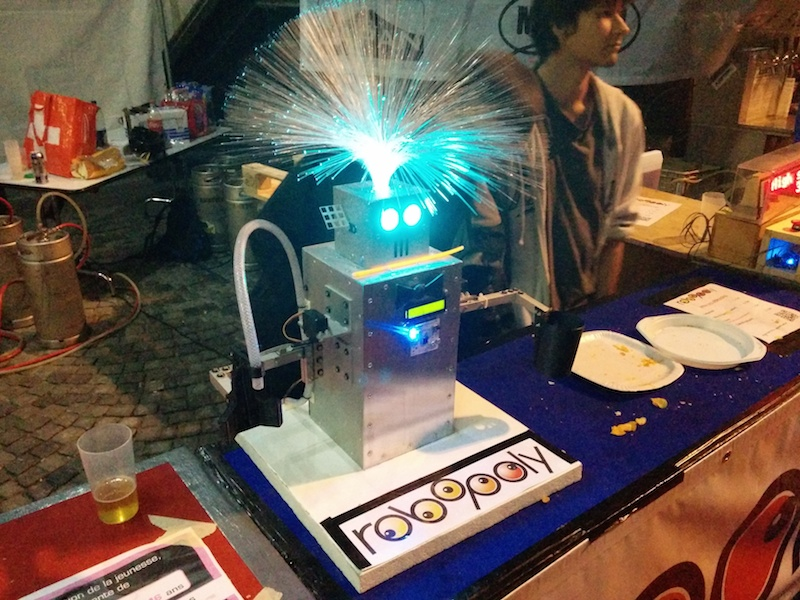
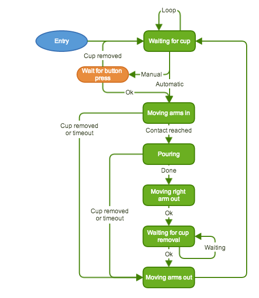

# Roberto

This is the program that runs in Roberto, the pastis serving robot of [Robopoly](http://robopoly.epfl.ch) made by Steven Roelofsen.

The program runs on a white version of the [PRismino](https://github.com/Robopoly/PRismino) that is attached to the front of the robot. It needs the [`robopolyLCD`](https://github.com/Robopoly/LCD-module) library for the LCD.

## Configuration

The program has been made so the robot could be configured live via the USB port, options that can be changed are: quantity of poured liquid, type of liquid (pastis or syrup) and method of serving (immediate or wait for button press).

There are 2 configurations for the robot, it usually server either syrup during non-alcoholic manifestations and then pastis during Vivapoly, the last big event of an academic year at EPFL.

Configuration commands:

| Command | Action                                          | Parameters                   			|
|---------|-------------------------------------------------|---------------------------------------|
| 1       | Set new pouring weight                          | n (pouring weight in g, int) 			|
| 2       | Check configuration                             |                              			|
| 3       | Read how many times the pump has been activated |                              			|
| 4       | Show sensor values                              |                              			|
| 5       | Change mode                                     | 0 = automatic, 1 = manual    			|
| 6       | Change type                                     | 0 = Ricard, 1 = syrup    (unused)    	|
| 7       | Enable debug mode                               |                              			|

So for example to set the pouring time the user first sends `1` to select the command and then sends the pouring time in milliseconds (ex: `2000`).

## Memory

Some information is stored in EEPROM to save it even when the robot is power cycled: drinks served, pouring time in milliseconds, serving type and serving mode. Drinks served and pouring time can be consulted at any time by pushing on the arm touch sensor on the right arm, the values will be shown on the front LCD.

## State machine

The program follows strictly a simple state machine that is very easy to manage:

In idle mode, while waiting for a cup to be inserted or removed, it moves and toggles its various servomotors and lights randomly to attract attention.

## Debug mode

The debug mode allows to enter a special mode that lets the user toggle on or off the lights, pump and show the sensor status on the LCD screen. To exit this mode the MCU has to be reset using the on-board button in front of the robot.

## Hardware design

The ears and hands are 3d printed. Only the ears are available as the others have gone lost (or unusable designs). The ears are identical and can easily be 3d printed.

The power system has been revised in May 2016, leading to the design of a new pump drive PCB featuring a MOSFET transistor. DC 5V regulation is now performed by Robopoly’s Power-Board instead of not-so-efficient linear regulators.

In 2017, a second pump was added. The pumps are driven by having stacked PCBs from 2016. Furthermore, a shield made from veroboard was made. It works as a normal shield instead of an "inverted shield". This way if the Prismino dies, any other can be used. 
Also, the amount of liquid to be poured is now measured using a scale instead of a timer (ie no measurement). This required the hand to be redesigned and the design can be found on the Fusion360 account of Robopoly.

## Credits

This project has been an ongoing one and a lot of people have been working on it without whom this wonderful robot would've never existed.

| Contribution       | Name                              										|
|--------------------|--------------------------------------------------------------------------|
| Creator            | Steven Roelofsen                  										|
| Programmers        | Karl Kangur, Taavet Kangur, Patrick Bobbink								|
| Electronics        | Marco Pagnamenta, Benjamin Bonnal, Paul-Edouard Sarlin, Patrick Bobbink 	|
| Cabling, mechanics | Lobsang Blanchard, Patrick Bobbink				           				|
